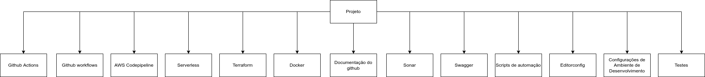
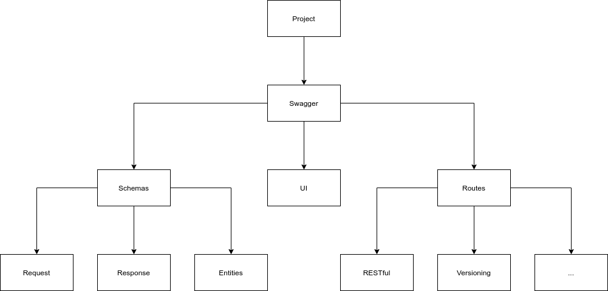
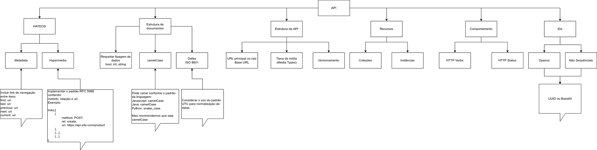
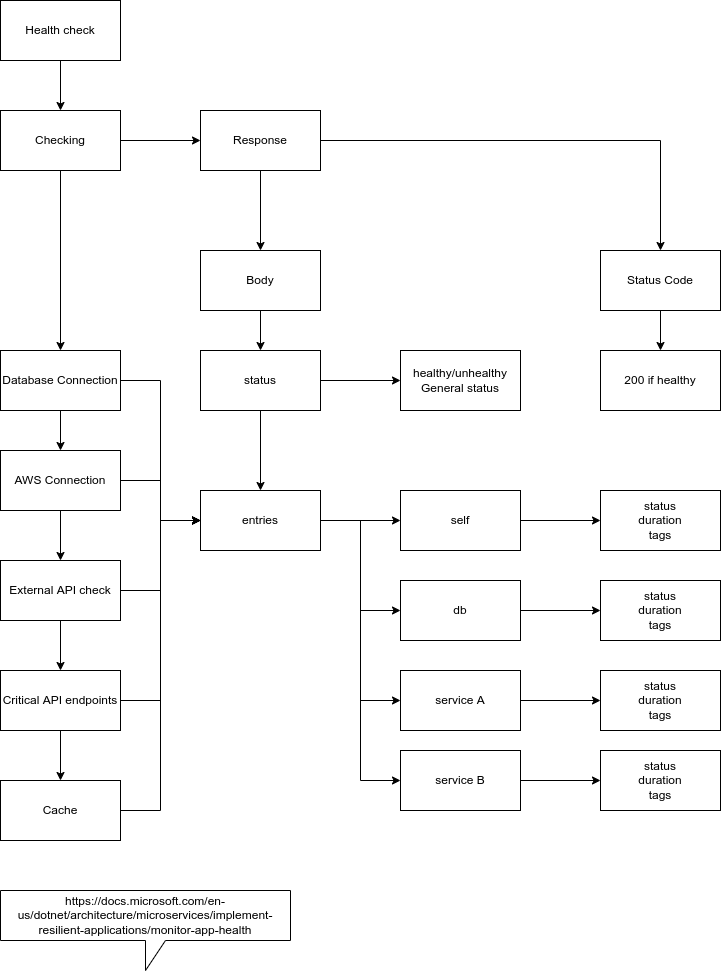
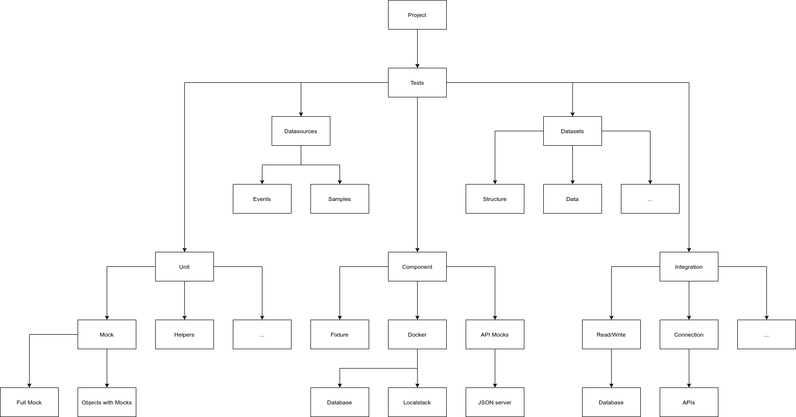

# Projects Guidelines (Work In Progress...)
Guidelines for configuring a project with the best standards of the internet.

## List of guidelines in different languages:
* [Guidelines in pt_BR](guidelines/pt_BR/README.md)

## Objective
Define a standard for our projects to facilitate their identification, comprehension and execution of it.

## Basic components of a project
In this section we present an overview of the components expected in an architecture that follows the guidelines standard.

### Diagram

## Github - Templates
Include standardized templates for:
* Pull Request
    * pull_request_template.md
* Issues
    * Bug Report
        * bug_report.md
        * bug_report.yml
    * Config
        * config.yml
    * Documentation Request
        * documentation_request.md
        * documentation_request.yml
    * Feature Request
        * feature_request.md
        * feature_request.yml

### Examples
To view examples of these files click in the links bellow:
* [pull_request_template.md](https://github.com/andersoncontreira/serverless-python-template/blob/main/.github/pull_request_template.md)
* [bug_report.md](https://github.com/andersoncontreira/serverless-python-template/blob/main/.github/ISSUE_TEMPLATE/bug_report.md)
* [bug_report.yml](https://github.com/andersoncontreira/serverless-python-template/blob/main/.github/ISSUE_TEMPLATE/bug_report.yml)
* [config.yml](https://github.com/andersoncontreira/serverless-python-template/blob/main/.github/ISSUE_TEMPLATE/config.yml)
* [documentation_request.md](https://github.com/andersoncontreira/serverless-python-template/blob/main/.github/ISSUE_TEMPLATE/documentation_request.md)
* [documentation_request.yml](https://github.com/andersoncontreira/serverless-python-template/blob/main/.github/ISSUE_TEMPLATE/documentation_request.yml)
* [feature_request.md](https://github.com/andersoncontreira/serverless-python-template/blob/main/.github/ISSUE_TEMPLATE/feature_request.md)
* [feature_request.yml](https://github.com/andersoncontreira/serverless-python-template/blob/main/.github/ISSUE_TEMPLATE/feature_request.yml)

## Github - Workflows
A workflow is a configurable automated process that will run one or more jobs. Workflows are defined by a YAML file checked in to your repository and will run when triggered by an event in your repository, or they can be triggered manually, or at a defined schedule.

Workflow suggestions:
* Lint
    * A linter or lint refers to tools that analyze source code for programming errors, bugs, stylistic errors, and suspicious builds.
* Unit Test
    * A unit test exercises the smallest piece of testable software in the application to determine whether it behaves as expected.
* Component Test
    * A component test limits the scope of the exercised software to a portion of the system under test, manipulating the system through internal code interfaces and using test doubles to isolate the code under test from other components. .
* Sonar
    * Code analysis tool to check code quality, duplicate code, vulnerabilities and bugs.
* Versioning
    * Perform project versioning following the SemVer standard;
* Guidelines
    * Validates whether the project is following the guidelines definitions;

### Examples
To view examples of these files click in the links bellow:
* [lint.yml](https://github.com/andersoncontreira/serverless-python-template/blob/main/.github/workflows/lint.yml)
* [unit_tests.yml](https://github.com/andersoncontreira/serverless-python-template/blob/main/.github/workflows/unit_tests.yml)
* [component_tests.yml](#)
* [sonar.yml](https://github.com/andersoncontreira/serverless-python-template/blob/main/.github/workflows/sonar.yml)
* [versioning.yml](#)
* [guidelines.yml](https://github.com/andersoncontreira/serverless-python-template/blob/main/.github/workflows/guidelines.yml)

### References
* [Docs Github - Workflows](https://docs.github.com/pt/actions/using-workflows/about-workflows)
* [Wikipedia - Lint](https://en.wikipedia.org/wiki/Lint_(software))
* [Wikipedia - Análise estática](https://en.wikipedia.org/wiki/Static_program_analysis)

## Github - Documentation
The project must have some files that help the user to understand the project, be able to install and run it, in addition to being able to obtain other information about it, using the respective files as a guide for the project evolution process.

[//]: # (### Diagram)

[//]: # (![Componentes de um projeto]&#40;./guidelines/images/github-projeto.png&#41;)

List of the files:
* README.md
    * You should add a README file to your repository to let others know why your project is useful, what they can do with the project, and how they can use it
* CHANGELOG.md
* CODE_OF_CONDUCT.md
* CONTRIBUTING.md
* LICENSE.md
    * For your repository to truly be open source, you'll need to license it so that others are free to use, change, and distribute the software.

### Examples
To view examples of these files click in the links bellow:
* [README.md](https://github.com/andersoncontreira/serverless-python-template/blob/main/README.md)
* [CHANGELOG.md](https://github.com/andersoncontreira/serverless-python-template/blob/main/CHANGELOG.md)
* [CODE_OF_CONDUCT.md](https://github.com/andersoncontreira/serverless-python-template/blob/main/CODE_OF_CONDUCT.md)
* [CONTRIBUTING.md](https://github.com/andersoncontreira/serverless-python-template/blob/main/CONTRIBUTING.md)
* [LICENSE.md](https://github.com/andersoncontreira/serverless-python-template/blob/main/LICENSE.md)

### More details
Below we have a link with more detailed information on this approach.
> Para mais detalhes acesse: [GITHUB-DOCUMENTATION.md](GITHUB-DOCUMENTATION.md)

### References
* [Docs Github - README](https://docs.github.com/pt/repositories/managing-your-repositorys-settings-and-features/customizing-your-repository/about-readmes)
* [Docs Github - LICENSE](https://docs.github.com/pt/repositories/managing-your-repositorys-settings-and-features/customizing-your-repository/licensing-a-repository)

## Sonar
The settings of code quality validation can be used by [SonarQube](https://www.sonarqube.org/) or [SonarCloud](http://sonarcloud.io/).

The `sonar-project.properties` file should contain the following settings:

* sonar.projectKey
    * Project key in `SonarCloud` platform or project name;
* sonar.organization
    * Company name or code registered on `SonarCloud`;
* sonar.source
    * Normally, a period (.) is used to refer to the root folder.
* sonar.exclusions
    * Folders that do not have code created by developers or folders with files that are not relevant for analysis, e.g. configuration files, docker files, node modules.
* sonar.tests
    * Folder containing all tests scripts;
* sonar.tests.inclusions
    * Pattern to identify test files;
* sonar.{linguagem} .coverage.reportPaths
    * Location of project coverage reports;
    * Clover pattern;
* sonar.junit.reportsPath
    * Location of project coverage reports;
    * JUnit patter;

### Examples
To view examples of these files click in the links bellow:
* [Go](./examples/go/sonar/sonar-project.properties)
* [Java](./examples/java/sonar/sonar-project.properties)
* [Node](https://github.com/andersoncontreira/serverless-node-template/blob/main/sonar-project.properties)
* [PHP](./examples/php/sonar/sonar-project.properties)
* [Python](https://github.com/andersoncontreira/serverless-python-template/blob/main/sonar-project.properties)

## OpenApi/Swagger
Files for dynamic API configuration.

### Diagram

### Schemas
A documentar
### Routes
A documentar
### UI
A documentar

### Examples
To view examples of these files click in the links bellow:
* [openapi.yml](https://github.com/andersoncontreira/serverless-python-template/blob/main/public/swagger/openapi.yml)
* UI
    * [UI](https://github.com/andersoncontreira/serverless-python-template/blob/main/public/swagger/index.html)
* Routes
    * [PHP - Routes](./examples/php/openapi/routes/routes.php)
    * [Python - Routes](https://github.com/andersoncontreira/serverless-python-template/blob/main/app.py)
* Schemas
    * PHP
        * [Schemas - API](./examples/php/openapi/schemas/Api.yaml)
        * [Schemas - Product](./examples/php/openapi/schemas/Entity/Product.yaml)
    * Python
        * [Schemas - API](https://github.com/andersoncontreira/serverless-python-template/blob/main/application/openapi/api_schemas.py)
        * [Schemas - General](https://github.com/andersoncontreira/serverless-python-template/blob/main/application/openapi/schemas.py)

### Referência para a documentação de rotas
The material that can be used to generate the inline documentation can be found here: https://swagger.io/specification/;

### More details
Below we have a link with more detailed information on this approach.
> Para mais detalhes acesse: [SWAGGER-DOCUMENTATION.md](SWAGGER-DOCUMENTATION.md)

## RESTful e HATEOS
When the project is an API, it is desirable that it implements the definitions of the RESTful standard.
Even better if you can apply HATEOS concepts.

### Diagram

### More details
Below we have a link with more detailed information on this approach.
> Para mais detalhes acesse: [RESTFUL-HATEOS-DOCUMENTATION.md](RESTFUL-HATEOS-DOCUMENTATION.md)

### References
* [Designing-a-Beautiful-REST%2BJSON-API.pdf](https://docs.huihoo.com/apache/apachecon/us2014/Designing-a-Beautiful-REST%2BJSON-API.pdf)
* [HTTP Methods for RESTful Services](https://www.restapitutorial.com/lessons/httpmethods.html#:~:text=The%20primary%20or%20most%2Dcommonly,but%20are%20utilized%20less%20frequently.)
* [RESTful Web Services Resources](https://www.restapitutorial.com/resources.html)
* [REST-API-Design-Filtering-Sorting-and-Pagination](https://www.moesif.com/blog/technical/api-design/REST-API-Design-Filtering-Sorting-and-Pagination/)
* [HTTP Status Dogs](https://httpstatusdogs.com/)

## Docker
Configuration of docker files for the project.

Docker files must be in the docker folder, being organized by context, examples:

* docker/
    * php/
        * Dockerfile
        * entrypoint.sh
    * nginx/
        * logs/*
        * Dockerfile
        * app.conf
        * nginx.conf
    * python/
        * Dockerfile
        * entrypoint.sh

### dockerignore
File with the references of folders and files that should be ignored by docker during copying
of the project folder's contents.

### docker-compose.yml
File with settings for managing containers in the development environment.

### More details
Below we have a link with more detailed information on this approach.
> Para mais detalhes acesse: [DOCKER-DOCUMENTATION.md](DOCKER-DOCUMENTATION.md)

## Healthcheck
Quando o projeto for uma API, é requerido que o mesmo implemente um endpoint de `healthcheck`, é recomendado que
o projeto aplique o padrão definido da documentação da guideline, para que o mesmo seja um endpoint inteligente.

### Diagram

### More details
Below we have a link with more detailed information on this approach.
> Para mais detalhes acesse: [HEALTHCHECK-DOCUMENTATION.md](HEALTHCHECK-DOCUMENTATION.md)

### References
* [Microsoft - Monitoramento de integridade](https://docs.microsoft.com/pt-br/dotnet/architecture/microservices/implement-resilient-applications/monitor-app-health)
* [Microsoft - Exemplo com ASP.NET Core](https://docs.microsoft.com/pt-br/aspnet/core/host-and-deploy/health-checks?view=aspnetcore-6.0)
* [Testfully - Artigo Health Check](https://testfully.io/blog/api-health-check-monitoring/)

## Testes
Description of the folder structure and concepts.

### Diagram

### Unit Tests
* Tests that use mocks to avoid real connections to external components;
* Tests focused on functionality and not on the data itself;
* Tests to run in CI pipelines;
* The duration of these tests should be a maximum of 1s per file, ideally running in milliseconds;

### Integration tests
* Tests that should not run fixtures or feature changes to avoid problems;
* Tests focused on the integration of external components with the application in question;
* Tests to run in CD pipelines;
* The duration of these will depend on the scenarios developed, however, it is recommended to create objective tests so that the pipeline does not take too long;

### Component Tests
* Base tests for the TDD process;
* Tests focused on the behavior, scenarios and data of the project process;
* Tests to be executed locally in a docker suite that will provide local access to resources such as databases and the like;
* The duration of these will depend on the scenarios developed, but the idea of these tests is to explore several possible scenarios;

### More details
Below we have a link with more detailed information on this approach.
> Para mais detalhes acesse: [TEST-DOCUMENTATION.md](TEST-DOCUMENTATION.md)

### References
* [Martin Fowler - Microservice Testing](https://martinfowler.com/articles/microservice-testing/)

## Serverless
WIP
## Editorconfig
WIP
## Terraform
WIP
## Pipeline (CI/CD)
WIP
## Automation Scripts
WIP
## VSCode settings
WIP
## Environment Configurations
WIP
## Binaries folder
WIP
## Git
Specific settings for the git project.

### gitignore
File with the references of folders and files that should be ignored by git during development
from the project.

## Metadata files
WIP
