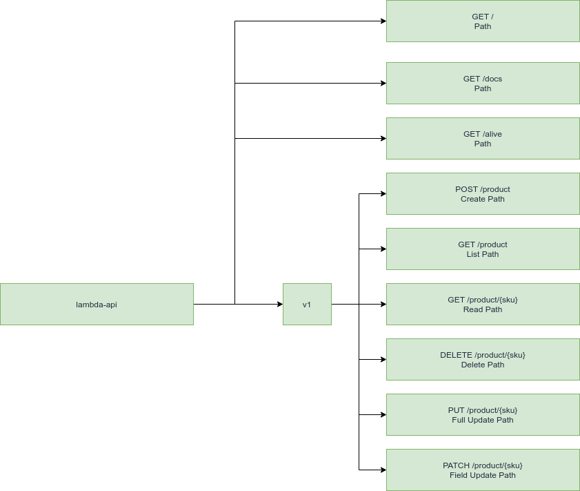

# RESTful e HATEOS - Documentation

In this document we will gather information regarding the standards and definitions necessary for an API to be in
according to the REST standard.
## Objective

The purpose of this guideline is to make it easy to apply REST in our APIs, so let's apply some concepts and
understand some fundamentals.

### Diagram


## Root of projeto

The application's main endpoint must return the name of the project and its current version.

Request:

```
http://localhost:5000/
```

Response:

```
{"app": "project-name:1.0.0"}
```

## Collections and Instances

Collections are for example listings and data types.

Example:

```
GET /products
```

Instances are collection items.

Example:

```
GET /products/0871b2de-7a97-41bc-8d24-aafae8f5b8be
```

## Behaviors

The behaviors of a REST API are delimited by verbs and HTTP status:

| HTTP Verb | Description                                                                       | Collection behavior      | Instance Behavior                                                                      | Examples                                                                                                                                                                                                                                                                                                                                                                                                                                                                                             |
|-----------|-----------------------------------------------------------------------------------|--------------------------|----------------------------------------------------------------------------------------|------------------------------------------------------------------------------------------------------------------------------------------------------------------------------------------------------------------------------------------------------------------------------------------------------------------------------------------------------------------------------------------------------------------------------------------------------------------------------------------------------|
| POST      | Instance creation                                                                 | 201 - Created            | <p>404 - Not Found</p><p>409 - Conflict - If the record already exists</p>             | <p>Request:</p><p>POST /products</p> <p>Response:</p> <p>Header Location with new ID 201 Created</p> <p>Location: /products /0871b2de-7a97-41bc-8d24-aafae8f5b8be</p>                                                                                                                                                                                                                                                                                                                                |
| GET       | <p>Reading collections or instances</p><p>Pagination</p><p>Sort</p><p>Filters</p> | 200 - OK                 | <p>200 - OK - Reading a single item</p><p>404 - Not Found - When the ID is invalid</p> | <p>Request from a collection:</p><p>GET /products</p><p>Request from an instance:</p><p>GET /products/0871b2de-7a97-41bc-8d24-aafae8f5b8be </p><p>Example of a collection being filtered:</p><p>GET /products?fields=name,description&sort=name&order=asc&offset=10&limit=20</p><p>Other examples:</p><p>GET /customers/</p><p>GET /customers/0871b2de-7a97-41bc-8d24-aafae8f5b8be/orders</p><p>GET /customers/0871b2de-7a97-41bc-8d24- aafae8f5b8be/orders/2693be21-1b16-4a2d-b91f-71b69724d54b</p> |
| PUT       | Full Upgrade (Replace)                                                            | 405 - Method not Allowed | <p>200 - OK</p><p>404 - Not Found - When the ID is invalid </p>                        | <p>Request:</p><p>PUT /products/0871b2de-7a97-41bc-8d24-aafae8f5b8be</p>                                                                                                                                                                                                                                                                                                                                                                                                                             |
| PATCH     | Atomic Update                                                                     | 405 - Method not Allowed | <p>200 - OK</p><p>404 - Not Found - When the ID is invalid</p>                         | <p>Request:</p><p>PATCH /products/0871b2de-7a97-41bc-8d24-aafae8f5b8be</p>                                                                                                                                                                                                                                                                                                                                                                                                                           |
| DELETE    | Deleting Items                                                                    | 405 - Method not Allowed | <p>200 - OK</p><p>404 - Not Found - When the ID is invalid</p>                         | <p>Request:</p><p>DELETE /products/0871b2de-7a97-41bc-8d24-aafae8f5b8be</p>                                                                                                                                                                                                                                                                                                                                                                                                                          |
## Resource names (Collections and instances)

Each resource must have a dedicated URI or its own address.

The operations must consist of the combination of URIs and HTTPs verbs.

## Resource building example

Let's say we are describing an ordering system in which we have customers, orders, categories, and products.
We will use URIs to describe and perform operations on these items:

### Customer List

To perform a list of clients, we must consume the following URI with the HTTP GET verb:

```
GET /customers
```

### Customer creation

To create a client, we need to consume the following URI with the HTTP POST verb:

```
POST /cutomers
```

### Atomic update of customer data

To update a client, we need to consume the following URI with the HTTP PATCH verb:

```
PATCH /customers/0871b2de-7a97-41bc-8d24-aafae8f5b8be
```

### Partial update of customer data

To perform a partial update of a client, we need to consume the following URI with the HTTP PUT verb:

```
PUT /customers/0871b2de-7a97-41bc-8d24-aafae8f5b8be
```

### Customer data replacement

To replace a client, we need to consume the following URI with the HTTP PUT verb:

```
PUT /customers/0871b2de-7a97-41bc-8d24-aafae8f5b8be
```

### Client deletion

To delete a client, we need to consume the following URI with the HTTP DELETE verb:

```
DELETE /customers/0871b2de-7a97-41bc-8d24-aafae8f5b8be
```

    <p>TODO:</p> 
    Map more complex examples here

> Reference: https://github.com/tfredrich/RestApiTutorial.com/raw/master/media/RESTful%20Best%20Practices-v1_2.pdf

#### Other examples:

* [Twitter API Documentation](https://developer.twitter.com/en/docs/twitter-api/early-access)
* [Facebook for Developers](https://developers.facebook.com/docs/graph-api/overview)
* [LinkedIn](https://developer.linkedin.com/#docs-and-tools)
* [AnyAPI](https://any-api.com/)

## Media Types

Normally we will work with APIs in JSON format, so use `application/json` by default.

```
Content-Type: application/json
```

### Serviços internos

Preferably use something straightforward like:

```
https://{service-name-api-name}.site.com.br
```

### Services by an API Gateway

When you have a single API:

```
https://api.site.com.br/{service-name}/{api-name}
```

## Main or root URL (Base URL)

In this section we provide guidance on configuring your service.

### Service versioning

Service versioning is the responsibility of the API, being managed via routes and configuration files, making
facilitated the maintenance or availability of new routes.

The API Gateway must point the route to the application and the rest can be managed by the same, the type of integration to be
performed in this case is via Proxy.

```
https://{service-name}.site.com.br/v1/{resource-name}/
```

#### Diagram:



## Resource formatting

In our APIs this is not a very common scenario, but for some context it may be necessary to support different
media types, so let's leave an example here.

### Requesting different media types (Media Types)

#### JSON (Padrão)

Requsição:

```
GET /products
Content-Type: application/json
```

Response:

```
200 OK
Content-Type: application/json
```

```json
{
  "success": true,
  "label": "common.success",
  "code": 1,
  "message": "Successful request",
  "params": [],
  "control": {
    "count": 1,
    "limit": 20,
    "offset": 0,
    "total": 100
  },
  "data": [
    {
      "id": "1",
      "uuid": "0871b2de-7a97-41bc-8d24-aafae8f5b8be",
      "name": "Pencil",
      "description": "Common pencil"
    }
  ],
  "links": [],
  "meta": {
    "first": "/products?offset=0&limit=20",
    "href": "/products?offset=0&limit=20",
    "last": "/products?offset=4&limit=20",
    "next": "/products?offset=1&limit=20",
    "previous": ""
  }
}
```

#### XML

Requsição:

```
GET /products
Content-Type: application/xml
```

Response:

```
200 OK
Content-Type: application/xml
```

```xml
<?xml version="1.0" encoding="UTF-8" ?>
<root>
    <success>true</success>
    <label>common.success</label>
    <code>1</code>
    <message>Successful request</message>
    <params/>
    <control>
        <count>1</count>
        <limit>20</limit>
        <offset>0</offset>
        <total>100</total>
    </control>
    <data>
        <id>1</id>
        <uuid>0871b2de-7a97-41bc-8d24-aafae8f5b8be</uuid>
        <name>Pencil</name>
        <description>Common pencil</description>
    </data>
    <links/>
    <meta>
        <first>/products?offset=0&amp;limit=20</first>
        <href>/products?offset=0&amp;limit=20</href>
        <last>/products?offset=4&amp;limit=20</last>
        <next>/products?offset=1&amp;limit=20</next>
        <previous></previous>
    </meta>
</root>
```

## Document structure

Below we will present recommendations and rules for the composition of documents.

### CamelCase

Preferably use camelCase, as javascript handles better and is also part of its convention.

### Date/Time/DateTime/Timestamp

By default use the ISO 8601 format, other possible alternatives are:

* ATOM
* RFC3339
* W3C

Example in PHP:

```php
/* Constantes */
const string ATOM = "Y-m-d\TH:i:sP";
const string ISO8601 = "Y-m-d\TH:i:sO";
const string RFC3339 = "Y-m-d\TH:i:sP";
const string W3C = "Y-m-d\TH:i:sP";
```

Examples:

```
2021-09-16T16:05:00.343Z
2021-09-16T16:05:00.426914-03:00
```

> Utilizar o timezone UTC preferencialmente, ou ao menos ter a indicação do fuso horário na string da data:</br>
> Neste exemplo abaixo temos o timezone BRT:<br/>
> 2021-09-16T16:05:00.426914-03:00

### Referências
* [ISO 8601](https://en.wikipedia.org/wiki/ISO_8601#:~:text=As%20of%20ISO%208601%2D1,hour%20between%2000%20and%2023.)
* [ISO 8601 — Date and time format](https://www.iso.org/iso-8601-date-and-time-format.html)
* [PHP: DateTime - Manual](https://www.php.net/manual/pt_BR/class.datetime.php)

## Response Body

You can configure your API not to return the body in some cases of POST requests, passing a flag via
querystring by adding the _body parameter.

### Examples

Request:

```
POST /products?_body=false
```

Response:

```
201 Created
Location: /products/0871b2de-7a97-41bc-8d24-aafae8f5b8be
No content
```

#### Listing cache data of systems

Request:

```
GET /v1/cache/systems
```

Response:

```
200 OK
```

```json
{
  "success": true,
  "label": "common.success",
  "code": 1,
  "message": "Success",
  "params": [],
  "data": [
    {
      "id": 1,
      "hash": "35070aaf185288daa04ed8fb519c11a99aa8e754",
      "name": "Brain",
      "company_id": 1,
      "squad": "drop-shipping-logistic"
    },
    {
      "id": 2,
      "hash": "dae51a2482328610a6b3261778768776132e633f",
      "name": "Eagle",
      "company_id": 1,
      "squad": "drop-shipping-logistic"
    },
    {
      "id": 3,
      "hash": "35b492c8dd4e13bcccdc0cf4c52e2b1eabc5b463",
      "name": "Delivery Simulator",
      "company_id": 2,
      "squad": "webstore-buy"
    },
    {
      "id": 4,
      "hash": "e213982e543d6887ae38cfcf001f71590294a1e3",
      "name": "Fretzy Deliver Time Reducer",
      "company_id": 2,
      "squad": "webstore-buy"
    }
  ],
  "control": {
    "offset": 0,
    "limit": 4,
    "total": 25,
    "count": 4
  }
}
```

#### Getting a system

Request:

```
GET /v1/cache/systems/35070aaf185288daa04ed8fb519c11a99aa8e754
```

Response:

```
200 OK
```

```json
{
  "success": true,
  "label": "common.success",
  "code": 1,
  "message": "Success",
  "params": [],
  "data": {
    "id": 1,
    "hash": "35070aaf185288daa04ed8fb519c11a99aa8e754",
    "name": "Brain",
    "company_id": 1,
    "squad": "drop-shipping-logistic"
  }
}
```

#### Error reading from a system

Request:

```
GET /v1/cache/systems/35070aaf185288daa04ed8fb519c11a99aa8e754
```

Response:

```
404 Not Found
```

```json
{
  "success": false,
  "label": "common.error.find_error",
  "code": 14,
  "message": "Unable to find the record",
  "params": [
    "35070aaf185288daa04ed8fb519c11a99aa8e754"
  ]
}
```

#### Error deleting a system

Request:

```
DELETE /v1/cache/systems
```

Response:

```
200 OK
```

```json
{
  "success": true,
  "label": "common.cache_deleted_with_success",
  "code": 1,
  "message": "Caches deleted with success",
  "params": [],
  "data": {}
}
```

#### Erro na exclusão de um sistema

Request:

```
DELETE /v1/cache/systems
```

Response:

```
500 Internal Server Error
```

```json
{
  "success": false,
  "label": "common.error.delete_list_error",
  "code": 25,
  "message": "Unable to delete the records",
  "params": [
  ]
}
```

#### Deleting a system

Request:

```
DELETE /v1/cache/systems/35070aaf185288daa04ed8fb519c11a99aa8e754
```

Response:

```
200 OK
```

```json
{
  "success": true,
  "label": "common.cache_deleted_with_success",
  "code": 1,
  "message": "Caches deleted with success %s",
  "params": [
    "35070aaf185288daa04ed8fb519c11a99aa8e754"
  ],
  "data": {}
}
```

### Error deleting a system

Request:

```
DELETE /v1/cache/systems/35070aaf185288daa04ed8fb519c11a99aa8e754
```

Response:

```
500 OK
```

```json
{
  "success": false,
  "label": "common.error.delete_error",
  "code": 26,
  "message": "Unable to delete the record %s",
  "params": [
    "35070aaf185288daa04ed8fb519c11a99aa8e754"
  ]
}
```

## IDs
The IDs must be opaque and not strings in order to avoid problems with explicit data collection by bots or even attacks.

Use hash or UUIDs;

Example:
```
Hash: 35070aaf185288daa04ed8fb519c11a99aa8e754
UUID: 0871b2de-7a97-41bc-8d24-aafae8f5b8be
```


## WIP

## References
* [RESTful Best Practices-v1_2.pdf](https://github.com/tfredrich/RestApiTutorial.com/raw/master/media/RESTful%20Best%20Practices-v1_2.pdf)
* [Designing-a-Beautiful-REST%2BJSON-API.pdf](https://docs.huihoo.com/apache/apachecon/us2014/Designing-a-Beautiful-REST%2BJSON-API.pdf)
* [HTTP Methods for RESTful Services](https://www.restapitutorial.com/lessons/httpmethods.html#:~:text=The%20primary%20or%20most%2Dcommonly,but%20are%20utilized%20less%20frequently.)
* [RESTful Web Services Resources](https://www.restapitutorial.com/resources.html)
* [REST-API-Design-Filtering-Sorting-and-Pagination](https://www.moesif.com/blog/technical/api-design/REST-API-Design-Filtering-Sorting-and-Pagination/)
* [HTTP Status Dogs](https://httpstatusdogs.com/)
