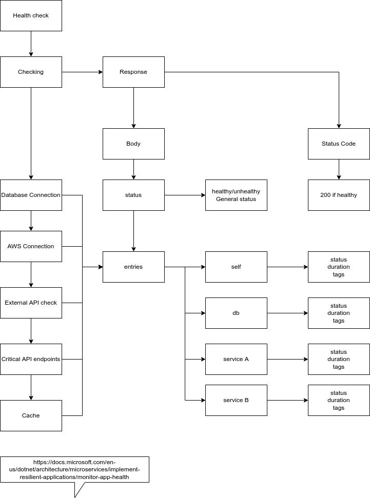
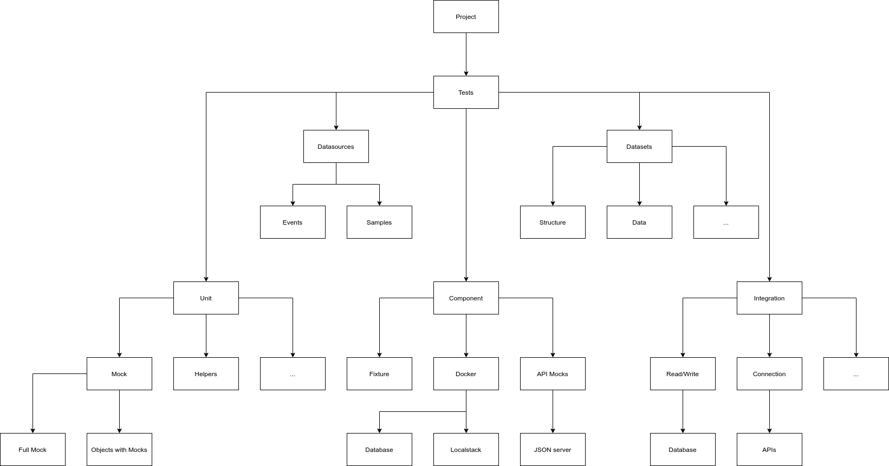

# Guidelines para projetos
Arquivo contendo orientações para a configuração de um projeto com os melhores padrões do mercado.

## Objetivo
Definir uma padronização para nossos projetos para facilitar a identificação, entendimento e execução dos mesmos.

## Componentes básicos de um projeto
Nesta seção apresentamos uma visão geral dos componentes esperados em uma arquitetura que segue o pradrão de guidelines.

### Diagrama

## Github - Templates
Incluir templates padronizados para:
* Pull Request
  * pull_request_template.md
* Issues
  * Bug Report
    * bug_report.md
    * bug_report.yml
  * Config
    * config.yml
  * Documentation Request
    * documentation_request.md
    * documentation_request.yml
  * Feature Request
    * feature_request.md
    * feature_request.yml

### Exemplos
Para visualizar exemplos destes arquivos acesse:
* [pull_request_template.md](https://github.com/andersoncontreira/serverless-python-template/blob/main/.github/pull_request_template.md)
* [bug_report.md](https://github.com/andersoncontreira/serverless-python-template/blob/main/.github/ISSUE_TEMPLATE/bug_report.md)
* [bug_report.yml](https://github.com/andersoncontreira/serverless-python-template/blob/main/.github/ISSUE_TEMPLATE/bug_report.yml)
* [config.yml](https://github.com/andersoncontreira/serverless-python-template/blob/main/.github/ISSUE_TEMPLATE/config.yml)
* [documentation_request.md](https://github.com/andersoncontreira/serverless-python-template/blob/main/.github/ISSUE_TEMPLATE/documentation_request.md)
* [documentation_request.yml](https://github.com/andersoncontreira/serverless-python-template/blob/main/.github/ISSUE_TEMPLATE/documentation_request.yml)
* [feature_request.md](https://github.com/andersoncontreira/serverless-python-template/blob/main/.github/ISSUE_TEMPLATE/feature_request.md)
* [feature_request.yml](https://github.com/andersoncontreira/serverless-python-template/blob/main/.github/ISSUE_TEMPLATE/feature_request.yml)

## Github - Workflows
Processos automatizados configuráveis que executam um ou mais trabalhos. Os fluxos de trabalho são definidos por um arquivo YAML verificado no seu repositório e será executado quando acionado por um evento no repositório, ou eles podem ser acionados manualmente ou de acordo com um cronograma definido.

Sugestões de fluxos de trabalho:
* Lint
  * Um linter ou lint se refere a ferramentas que analisam código-fonte para acusar erros de programação, bugs, erros estilísticos, e construções suspeitas. 
* Unit Test
  * Um teste de unidade exercita a menor parte do software testável no aplicativo para determinar se ele se comporta conforme o esperado. 
* Component Test
  * Um teste de componente limita o escopo do software exercitado a uma parte do sistema em teste, manipulando o sistema por meio de interfaces de código interno e usando duplicatas de teste para isolar o código em teste de outros componentes.
* Sonar
  * Ferramenta de análise de código para verificar a qualidade do código, código duplicado, vulnerabilidades e bugs.
* Versioning
  * Realizar o versionamento do projeto seguindo o padrão SemVer;
* Guidelines
  * Valida se o projeto está seguindo as definições de boas práticas;

### Exemplos
Para visualizar exemplos destes arquivos acesse:
* [lint.yml](https://github.com/andersoncontreira/serverless-python-template/blob/main/.github/workflows/lint.yml)
* [unit_tests.yml](https://github.com/andersoncontreira/serverless-python-template/blob/main/.github/workflows/unit_tests.yml)
* [component_tests.yml](#)
* [sonar.yml](https://github.com/andersoncontreira/serverless-python-template/blob/main/.github/workflows/sonar.yml)
* [versioning.yml](#)
* [guidelines.yml](https://github.com/andersoncontreira/serverless-python-template/blob/main/.github/workflows/guidelines.yml)

### Referências
* [Docs Github - Workflows](https://docs.github.com/pt/actions/using-workflows/about-workflows)
* [Wikipedia - Lint](https://en.wikipedia.org/wiki/Lint_(software))
* [Wikipedia - Análise estática](https://en.wikipedia.org/wiki/Static_program_analysis) 

## Github - Documentação
O projeto deve possuir alguns arquivos que ajudem o usuário a entender o projeto, conseguir instalar e executar o mesmo, além de poder obter outras informações do mesmo, utilizando os arquivos respectivos como guia para o processo de evolução do projeto.

[//]: # (### Diagrama)

[//]: # (![Componentes de um projeto]&#40;../images/github-projeto.png&#41;)

Lista de arquivos:
* README.md
  * Você deve adicionar um arquivo README ao seu repositório para informar outras pessoas por que seu projeto é útil, o que elas podem fazer com o projeto e como elas podem usá-lo.
* CHANGELOG.md
* CODE_OF_CONDUCT.md
* CONTRIBUTING.md
* LICENSE.md
  * Para que seu repositório seja realmente de código aberto, você precisará licenciá-lo para que outros tenham a liberdade de usar, alterar e distribuir o software. 
  
### Exemplos
Para visualizar exemplos destes arquivos acesse:
* [README.md](https://github.com/andersoncontreira/serverless-python-template/blob/main/README.md)
* [CHANGELOG.md](https://github.com/andersoncontreira/serverless-python-template/blob/main/CHANGELOG.md)
* [CODE_OF_CONDUCT.md](https://github.com/andersoncontreira/serverless-python-template/blob/main/CODE_OF_CONDUCT.md)
* [CONTRIBUTING.md](https://github.com/andersoncontreira/serverless-python-template/blob/main/CONTRIBUTING.md)
* [LICENSE.md](https://github.com/andersoncontreira/serverless-python-template/blob/main/LICENSE.md)

### Mais detalhes
Abaixo temos um link com informações mais detalhadas desta abordagem.
> Para mais detalhes acesse: [GITHUB-DOCUMENTATION.md](GITHUB-DOCUMENTATION.md)

### Referências
* [Docs Github - README](https://docs.github.com/pt/repositories/managing-your-repositorys-settings-and-features/customizing-your-repository/about-readmes)
* [Docs Github - LICENSE](https://docs.github.com/pt/repositories/managing-your-repositorys-settings-and-features/customizing-your-repository/licensing-a-repository)

## Sonar
Configurações para a validação de qualidade de código, podendo ser via [SonarQube](https://www.sonarqube.org/) ou [SonarCloud](http://sonarcloud.io/).

O arquivo `sonar-project.properties`  deve conter as seguintes configurações:

* sonar.projectKey
  * Chave do projeto na plataforma `SonarCloud` ou nome do projeto;
* sonar.organization
  * Nome da empresa ou código registrado no `SonarCloud`;
* sonar.source
  * Normalmente usa-se o ponto (.) para referenciar a pasta raiz;
* sonar.exclusions
  * Pastas que não possuem códigos criados pelos desenvolvedores ou pastas com arquivos que não são relevantes para a análise, por exemplo, arquivos de configuração, arquivos de docker, pasta de módulos do node;
* sonar.tests
  * Pasta que contem todos os testes;
* sonar.tests.inclusions
  * Padrão para identificar os arquivos de testes;
* sonar.{linguagem} .coverage.reportPaths
  * Localização dos relatórios de cobertura do projeto;
  * Padrão Clover
* sonar.junit.reportsPath
  * Localização dos relatórios de cobertura do projeto;
  * Padrão JUnit

### Exemplos
Para visualizar exemplos destes arquivos acesse:
* [Go](../../examples/go/sonar/sonar-project.properties)
* [Java](../../examples/java/sonar/sonar-project.properties)
* [Node](https://github.com/andersoncontreira/serverless-node-template/blob/main/sonar-project.properties)
* [PHP](../../examples/php/sonar/sonar-project.properties)
* [Python](https://github.com/andersoncontreira/serverless-python-template/blob/main/sonar-project.properties)

## OpenApi/Swagger
Arquivos para a configuração dinâmica da API.

### Diagrama

### Schemas
A documentar
### Routes
A documentar
### UI
A documentar

### Exemplos
Para visualizar exemplos destes arquivos acesse:
* [openapi.yml](https://github.com/andersoncontreira/serverless-python-template/blob/main/public/swagger/openapi.yml)
* UI
  * [UI](https://github.com/andersoncontreira/serverless-python-template/blob/main/public/swagger/index.html)
* Routes
  * [PHP - Routes](../../examples/php/openapi/routes/routes.php)
  * [Python - Routes](https://github.com/andersoncontreira/serverless-python-template/blob/main/app.py)
* Schemas
  * PHP
    * [Schemas - API](../../examples/php/openapi/schemas/Api.yaml)
    * [Schemas - Product](../../examples/php/openapi/schemas/Entity/Product.yaml)
  * Python
    * [Schemas - API](https://github.com/andersoncontreira/serverless-python-template/blob/main/application/openapi/api_schemas.py)
    * [Schemas - General](https://github.com/andersoncontreira/serverless-python-template/blob/main/application/openapi/schemas.py)

### Referência para a documentação de rotas
O material que pode ser utilizado para gerar as documentações inline você encontra aqui: https://swagger.io/specification/

### Mais detalhes
Abaixo temos um link com informações mais detalhadas desta abordagem.
> Para mais detalhes acesse: [SWAGGER-DOCUMENTATION.md](SWAGGER-DOCUMENTATION.md)

## RESTful e HATEOS
Quando o projeto for uma API, é desejável que o mesmo implemente as definições do padrão RESTful.
Melhor ainda se puder aplicar conceitos de HATEOS.

### Diagrama

### Mais detalhes
Abaixo temos um link com informações mais detalhadas desta abordagem.
> Para mais detalhes acesse: [RESTFUL-HATEOS-DOCUMENTATION.md](RESTFUL-HATEOS-DOCUMENTATION.md)

### Referências
* [Designing-a-Beautiful-REST%2BJSON-API.pdf](https://docs.huihoo.com/apache/apachecon/us2014/Designing-a-Beautiful-REST%2BJSON-API.pdf)
* [HTTP Methods for RESTful Services](https://www.restapitutorial.com/lessons/httpmethods.html#:~:text=The%20primary%20or%20most%2Dcommonly,but%20are%20utilized%20less%20frequently.)
* [RESTful Web Services Resources](https://www.restapitutorial.com/resources.html)
* [REST-API-Design-Filtering-Sorting-and-Pagination](https://www.moesif.com/blog/technical/api-design/REST-API-Design-Filtering-Sorting-and-Pagination/)
* [HTTP Status Dogs](https://httpstatusdogs.com/)

## Docker
Configuração de arquivos de docker para o projeto.

Arquivos de docker devem estar na pasta docker, sendo organizados por contexto, exemplos:

* docker/
  * php/
    * Dockerfile
    * entrypoint.sh
  * nginx/
    * logs/*
    * Dockerfile
    * app.conf
    * nginx.conf
  * python/
    * Dockerfile
    * entrypoint.sh

### dockerignore
Arquivo com as referências de pastas e arquivos que devem ser ignorados pelo docker durante a cópia
de conteúdo da pasta do projeto.

### docker-compose.yml
Arquivo com configurações para gestão de containers no ambiente de desenvolvimento.

### Mais detalhes
Abaixo temos um link com informações mais detalhadas desta abordagem.
> Para mais detalhes acesse: [DOCKER-DOCUMENTATION.md](DOCKER-DOCUMENTATION.md)

## Healthcheck
Quando o projeto for uma API, é requerido que o mesmo implemente um endpoint de `healthcheck`, é recomendado que
o projeto aplique o padrão definido da documentação da guideline, para que o mesmo seja um endpoint inteligente.

### Diagrama

### Mais detalhes
Abaixo temos um link com informações mais detalhadas desta abordagem.
> Para mais detalhes acesse: [HEALTHCHECK-DOCUMENTATION.md](HEALTHCHECK-DOCUMENTATION.md)

### Referências
Para mais detalhes ver:
* [Microsoft - Monitoramento de integridade](https://docs.microsoft.com/pt-br/dotnet/architecture/microservices/implement-resilient-applications/monitor-app-health)
* [Microsoft - Exemplo com ASP.NET Core](https://docs.microsoft.com/pt-br/aspnet/core/host-and-deploy/health-checks?view=aspnetcore-6.0)
* [Testfully - Artigo Health Check](https://testfully.io/blog/api-health-check-monitoring/)

## Testes
Descrição da estrutura da pasta e conceitos.

### Diagrama

### Testes de unidade
* Testes que se utiliza de mocks para evitar conexões reais a componetes externos;
* Testes focados na funcionalidade e não nos dados em si;
* Testes para serem executados em pipelines de CI;
* A duração destes testes devem ser de no máximo 1s por arquivo, sendo o ideal rodar em milisegundos;

### Testes de integração
* Testes que não devem executar fixtures ou alterações de recursos para evitar problemas;
* Testes focados na integração de componentes externos com a aplicação em questão;
* Testes para serem executados em pipelines de CD;
* A duração destes vai depender dos cenários desenvolvidos, porém recomendado criar testes objetivos para não demorar muito o pipeline;

### Testes de componentes
* Testes bases para o processo de TDD;
* Testes focados no comportamento, cenários e dados dos processo do projeto;
* Testes para serem executados localmente em conjunto do docker que irá prover o acesso local a recursos como banco de dados e afins;
* A duração destes vai depender dos cenários desenvolvidos, mas a ideia destes testes é explorar diversos cenários possíveis;

### Mais detalhes
Abaixo temos um link com informações mais detalhadas desta abordagem.
> Para mais detalhes acesse: [TEST-DOCUMENTATION.md](TEST-DOCUMENTATION.md)

### Referências
* [Martin Fowler - Microservice Testing](https://martinfowler.com/articles/microservice-testing/)

## Serverless
a documentar
## Editorconfig
a documentar
## Terraform
a documentar
## Pipeline (CI/CD)
a documentar
## Automation Scripts
a documentar
## VSCode settings
a documentar
## Environment Configurations
a documentar
## Binaries folder
a documentar
## Git
Configurações específicas para o projeto git.

### gitignore
Arquivo com as referências de pastas e arquivos que devem ser ignorados pelo git durante o desenvolvimento
do projeto.

## Metadata files
a documentar
