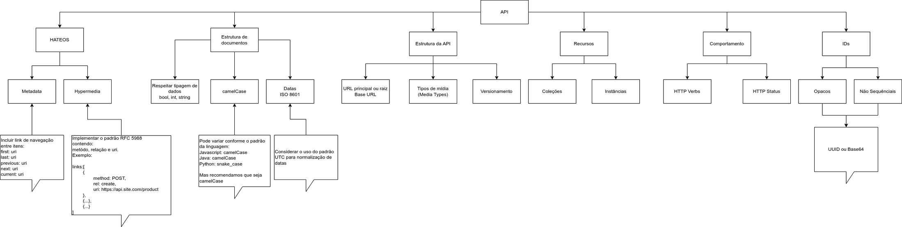

# RESTful e HATEOS - Documentação

Neste documento vamos reunir informações referentes aos padrões e definições necessários para que uma API esteja em
acordo com o padrão REST.

## Objetivo

O objetivo deste guideline é tornar fácil a aplicação do REST em nossas APIs, então vamos aplicar alguns conceitos e
entender alguns fundamentos.

### Diagrama



## Raiz do projeto

O endpoint principal da aplicação deve retornar o nome do projeto e a versão atual do mesmo.

Requisição:

```
http://localhost:5000/
```

Resposta:

```
{"app": "project-name:1.0.0"}
```

## Coleções e Instâncias

Coleções são por exemplo as listagens e tipagens de dados.

Exemplo:

```
GET /products
```

Instancias são itens dessas coleções

Exemplo:

```
GET /products/0871b2de-7a97-41bc-8d24-aafae8f5b8be
```

## Comportamentos

Os comportamentos de uma API REST são delimitados por verbos e HTTP status:

| Verbo HTTP | Descrição                                                                              | Comportamento sobre coleção | Comportamento sobre instância                                                               | Exemplos                                                                                                                                                                                                                                                                                                                                                                                                                                                                                              |
|------------|----------------------------------------------------------------------------------------|-----------------------------|---------------------------------------------------------------------------------------------|-------------------------------------------------------------------------------------------------------------------------------------------------------------------------------------------------------------------------------------------------------------------------------------------------------------------------------------------------------------------------------------------------------------------------------------------------------------------------------------------------------|
| POST       | Criação de instância                                                                   | 201 - Created               | <p>404 - Not Found</p><p>409 - Conflict - Se o registro já existir</p>                      | <p>Requisição:</p> <p>POST /products</p>  <p>Resposta:</p> <p>Header Location com o novo ID 201 Created</p>  <p>Location: /products/0871b2de-7a97-41bc-8d24-aafae8f5b8be</p>                                                                                                                                                                                                                                                                                                                          |
| GET        | <p>Leitura de coleções ou instâncias</p><p>Paginação</p><p>Ordenação</p><p>Filtros</p> | 200 - OK                    | <p>200 - OK - Leitura de um único item</p><p>404 - Not Found - Quando o ID for inválido</p> | <p>Requisição de uma coleção:</p><p>GET /products</p><p>Requisição de uma instância:</p><p>GET /products/0871b2de-7a97-41bc-8d24-aafae8f5b8be</p><p>Exemplo de uma coleção sendo filtrada:</p><p>GET /products?fields=name,description&sort=name&order=asc&offset=10&limit=20</p><p>Outros exemplos:</p><p>GET /customers/</p><p>GET /customers/0871b2de-7a97-41bc-8d24-aafae8f5b8be/orders</p><p>GET /customers/0871b2de-7a97-41bc-8d24-aafae8f5b8be/orders/2693be21-1b16-4a2d-b91f-71b69724d54b</p> |
| PUT        | Atualização completa (Replace)                                                         | 405 - Method not Allowed    | <p>200 - OK</p><p>404 - Not Found - Quando o ID for inválido </p>                           | <p>Requisição:</p><p>PUT /products/0871b2de-7a97-41bc-8d24-aafae8f5b8be</p>                                                                                                                                                                                                                                                                                                                                                                                                                           |
| PATCH      | Atualização atômica                                                                    | 405 - Method not Allowed    | <p>200 - OK</p><p>404 - Not Found - Quando o ID for inválido</p>                            | <p>Requisição:</p><p>PATCH /products/0871b2de-7a97-41bc-8d24-aafae8f5b8be</p>                                                                                                                                                                                                                                                                                                                                                                                                                         |
| DELETE     | Exclusão de items                                                                      | 405 - Method not Allowed    | <p>200 - OK</p><p>404 - Not Found - Quando o ID for inválido</p>                            | <p>Requisição:</p> <p>DELETE /products/0871b2de-7a97-41bc-8d24-aafae8f5b8be</p>                                                                                                                                                                                                                                                                                                                                                                                                                       |

## Nomes de recursos (Coleções e instâncias)

Cada recurso deve possuir uma URI dedicada ou seu próprio endereço.

As operações devem ser constituídas pela combinação de URIs e verbos HTTPs.

## Exemplo de construção de recursos

Vamos dizer que estamos descrevendo uma sistema de pedidos no qual temos clientes, pedidos, categorias e produtos.
Iremos usar URIs para descrever e realizar operações sobre estes itens:

### Listagem de clientes

Para realizarmos uma listagem de clientes devemos consumir a seguinte URI com o verbo HTTP GET:

```
GET /customers
```

### Criação de cliente

Para realizarmos a criação de um cliente precisamos consumir a seguinte URI com o verbo HTTP POST:

```
POST /cutomers
```

### Atualização atômica de dado de cliente

Para realizarmos a atualização de um cliente precisamos consumir a seguinte URI com o verbo HTTP PATCH:

```
PATCH /customers/0871b2de-7a97-41bc-8d24-aafae8f5b8be
```

### Atualização parcial  de dados de cliente

Para realizarmos a atualização parcial de um cliente precisamos consumir a seguinte URI com o verbo HTTP PUT:

```
PUT /customers/0871b2de-7a97-41bc-8d24-aafae8f5b8be
```

### Substituição de dados de cliente

Para realizarmos a substituição de um cliente precisamos consumir a seguinte URI com o verbo HTTP PUT:

```
PUT /customers/0871b2de-7a97-41bc-8d24-aafae8f5b8be
```

### Exclusão de cliente

Para realizarmos a exclusão de um cliente precisamos consumir a seguinte URI com o verbo HTTP DELETE:

```
DELETE /customers/0871b2de-7a97-41bc-8d24-aafae8f5b8be
```

    <p>TODO:</p> 
    Mapear mais exemplos complexos aqui

> Referências: https://github.com/tfredrich/RestApiTutorial.com/raw/master/media/RESTful%20Best%20Practices-v1_2.pdf

#### Outros exemplos:

* [Twitter API Documentation](https://developer.twitter.com/en/docs/twitter-api/early-access)
* [Facebook for Developers](https://developers.facebook.com/docs/graph-api/overview)
* [LinkedIn](https://developer.linkedin.com/#docs-and-tools)
* [AnyAPI](https://any-api.com/)

## Tipos me mídia (Media Types)

Normalmente vamos trabalhar com APIs no formato JSON, então usar `application/json` como padrão.

```
Content-Type: application/json
```

### Serviços internos

Preferencialmente usar algo direto como:

```
https://{service-name-api-name}.site.com.br
```

### Serviços via API Gateway

Quando tiver uma única API:

```
https://api.site.com.br/{service-name}/{api-name}
```

## URL príncipal ou raiz (Base URL)

Nesta seção apresentamos orientações sobre a configuração de seu serviço.

### Versionamento de serviços

O versionamento de serviços fica por responsabilidade da API, sendo gerido via rotas e arquivos configurações, tornando
facilitada a manutenção ou disponibilização de novas rotas.

O API Gateway deve apontar a rota até a aplicação e o restante pode ser gerido pela mesma, o tipo de integração a ser
realizado neste caso é via Proxy.

```
https://{service-name}.site.com.br/v1/{resource-name}/
```

#### Diagrama:


## Formatação de recursos

Em nossas APIs não é um cenário muito comum, porém para algum contexto pode vir a ser necessário suportar diferentes
media types, então vamos deixar um exemplo aqui.

### Requisitando diferentes tipos de mídia (Media Types)

#### JSON (Padrão)

Requsição:

```
GET /products
Content-Type: application/json
```

Response:

```
200 OK
Content-Type: application/json
```

```json
{
  "success": true,
  "label": "common.success",
  "code": 1,
  "message": "Successful request",
  "params": [],
  "control": {
    "count": 1,
    "limit": 20,
    "offset": 0,
    "total": 100
  },
  "data": [
    {
      "id": "1",
      "uuid": "0871b2de-7a97-41bc-8d24-aafae8f5b8be",
      "name": "Pencil",
      "description": "Common pencil"
    }
  ],
  "links": [],
  "meta": {
    "first": "/products?offset=0&limit=20",
    "href": "/products?offset=0&limit=20",
    "last": "/products?offset=4&limit=20",
    "next": "/products?offset=1&limit=20",
    "previous": ""
  }
}
```

#### XML

Requsição:

```
GET /products
Content-Type: application/xml
```

Response:

```
200 OK
Content-Type: application/xml
```

```xml
<?xml version="1.0" encoding="UTF-8" ?>
<root>
    <success>true</success>
    <label>common.success</label>
    <code>1</code>
    <message>Successful request</message>
    <params/>
    <control>
        <count>1</count>
        <limit>20</limit>
        <offset>0</offset>
        <total>100</total>
    </control>
    <data>
        <id>1</id>
        <uuid>0871b2de-7a97-41bc-8d24-aafae8f5b8be</uuid>
        <name>Pencil</name>
        <description>Common pencil</description>
    </data>
    <links/>
    <meta>
        <first>/products?offset=0&amp;limit=20</first>
        <href>/products?offset=0&amp;limit=20</href>
        <last>/products?offset=4&amp;limit=20</last>
        <next>/products?offset=1&amp;limit=20</next>
        <previous></previous>
    </meta>
</root>
```

## Estrutura dos documentos

Abaixo iremos apresentar recomendações e regras para a composição dos documentos.

### CamelCase

Usar preferencialmente camelCase, pois o javascript lida melhor e também faz parte de sua convenção.

### Date/Time/DateTime/Timestamp

Por padrão usar o formato ISO 8601, outras possíveis alternativas são:

* ATOM
* RFC3339
* W3C

Exemplo em PHP:

```php
/* Constantes */
const string ATOM = "Y-m-d\TH:i:sP";
const string ISO8601 = "Y-m-d\TH:i:sO";
const string RFC3339 = "Y-m-d\TH:i:sP";
const string W3C = "Y-m-d\TH:i:sP";
```

Exemplos:

```
2021-09-16T16:05:00.343Z
2021-09-16T16:05:00.426914-03:00
```

> Utilizar o timezone UTC preferencialmente, ou ao menos ter a indicação do fuso horário na string da data:</br>
> Neste exemplo abaixo temos o timezone BRT:<br/>
> 2021-09-16T16:05:00.426914-03:00

### Referências

Para mais detalhes ver:

* [ISO 8601](https://en.wikipedia.org/wiki/ISO_8601#:~:text=As%20of%20ISO%208601%2D1,hour%20between%2000%20and%2023.)
* [ISO 8601 — Date and time format](https://www.iso.org/iso-8601-date-and-time-format.html)
* [PHP: DateTime - Manual](https://www.php.net/manual/pt_BR/class.datetime.php)

## Response Body

Você pode configurar a sua API para não retornar o body em alguns casos de requisições POST, passando uma flag via
querystring, adicionando o parâmetro _body.

### Exemplos

Requisição:

```
POST /products?_body=false
```

Resposta:

```
201 Created
Location: /products/0871b2de-7a97-41bc-8d24-aafae8f5b8be
No content
```

#### Listagem de dados de cache para sistemas

Requisição:

```
GET /v1/cache/systems
```

Resposta:

```
200 OK
```

```json
{
  "success": true,
  "label": "common.success",
  "code": 1,
  "message": "Success",
  "params": [],
  "data": [
    {
      "id": 1,
      "hash": "35070aaf185288daa04ed8fb519c11a99aa8e754",
      "name": "Brain",
      "company_id": 1,
      "squad": "drop-shipping-logistic"
    },
    {
      "id": 2,
      "hash": "dae51a2482328610a6b3261778768776132e633f",
      "name": "Eagle",
      "company_id": 1,
      "squad": "drop-shipping-logistic"
    },
    {
      "id": 3,
      "hash": "35b492c8dd4e13bcccdc0cf4c52e2b1eabc5b463",
      "name": "Delivery Simulator",
      "company_id": 2,
      "squad": "webstore-buy"
    },
    {
      "id": 4,
      "hash": "e213982e543d6887ae38cfcf001f71590294a1e3",
      "name": "Fretzy Deliver Time Reducer",
      "company_id": 2,
      "squad": "webstore-buy"
    }
  ],
  "control": {
    "offset": 0,
    "limit": 4,
    "total": 25,
    "count": 4
  }
}
```

#### Leitura de um sistema

Requisição:

```
GET /v1/cache/systems/35070aaf185288daa04ed8fb519c11a99aa8e754
```

Resposta:

```
200 OK
```

```json
{
  "success": true,
  "label": "common.success",
  "code": 1,
  "message": "Success",
  "params": [],
  "data": {
    "id": 1,
    "hash": "35070aaf185288daa04ed8fb519c11a99aa8e754",
    "name": "Brain",
    "company_id": 1,
    "squad": "drop-shipping-logistic"
  }
}
```

#### Erro na leitura de um sistema

Requisição:

```
GET /v1/cache/systems/35070aaf185288daa04ed8fb519c11a99aa8e754
```

Resposta:

```
404 Not Found
```

```json
{
  "success": false,
  "label": "common.error.find_error",
  "code": 14,
  "message": "Unable to find the record",
  "params": [
    "35070aaf185288daa04ed8fb519c11a99aa8e754"
  ]
}
```

#### Exclusão de todos os sistemas

Requisição:

```
DELETE /v1/cache/systems
```

Resposta:

```
200 OK
```

```json
{
  "success": true,
  "label": "common.cache_deleted_with_success",
  "code": 1,
  "message": "Caches deleted with success",
  "params": [],
  "data": {}
}
```

#### Erro na exclusão de um sistema

Requisição:

```
DELETE /v1/cache/systems
```

Resposta:

```
500 Internal Server Error
```

```json
{
  "success": false,
  "label": "common.error.delete_list_error",
  "code": 25,
  "message": "Unable to delete the records",
  "params": [
  ]
}
```

#### Exclusão de um sistemas

Requisição:

```
DELETE /v1/cache/systems/35070aaf185288daa04ed8fb519c11a99aa8e754
```

Resposta:

```
200 OK
```

```json
{
  "success": true,
  "label": "common.cache_deleted_with_success",
  "code": 1,
  "message": "Caches deleted with success %s",
  "params": [
    "35070aaf185288daa04ed8fb519c11a99aa8e754"
  ],
  "data": {}
}
```

### Erro na exclusão de um sistema

Requisição:

```
DELETE /v1/cache/systems/35070aaf185288daa04ed8fb519c11a99aa8e754
```

Resposta:

```
500 OK
```

```json
{
  "success": false,
  "label": "common.error.delete_error",
  "code": 26,
  "message": "Unable to delete the record %s",
  "params": [
    "35070aaf185288daa04ed8fb519c11a99aa8e754"
  ]
}
```

## IDs
Os IDs devem ser opacos e não sequências afim de evitar problemas de coleta explicita de dados por bot ou até ataques.

Utilizar hashs ou UUIDs;

Exemplo:
```
Hash: 35070aaf185288daa04ed8fb519c11a99aa8e754
UUID: 0871b2de-7a97-41bc-8d24-aafae8f5b8be
```


## WIP

## Referências

Para mais detalhes ver:

* [RESTful Best Practices-v1_2.pdf](https://github.com/tfredrich/RestApiTutorial.com/raw/master/media/RESTful%20Best%20Practices-v1_2.pdf)
* [Designing-a-Beautiful-REST%2BJSON-API.pdf](https://docs.huihoo.com/apache/apachecon/us2014/Designing-a-Beautiful-REST%2BJSON-API.pdf)
* [HTTP Methods for RESTful Services](https://www.restapitutorial.com/lessons/httpmethods.html#:~:text=The%20primary%20or%20most%2Dcommonly,but%20are%20utilized%20less%20frequently.)
* [RESTful Web Services Resources](https://www.restapitutorial.com/resources.html)
* [REST-API-Design-Filtering-Sorting-and-Pagination](https://www.moesif.com/blog/technical/api-design/REST-API-Design-Filtering-Sorting-and-Pagination/)
* [HTTP Status Dogs](https://httpstatusdogs.com/)
