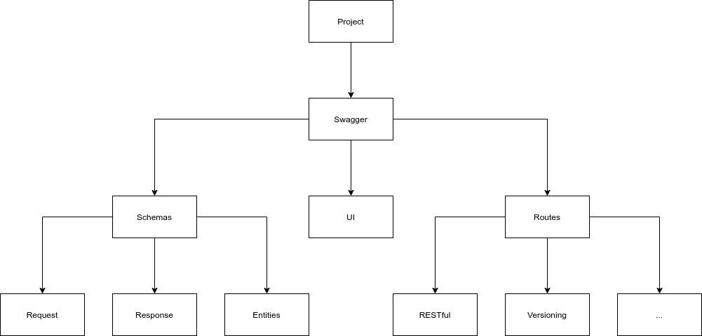

# Swagger - Documentação

Documentação dinâmica de APIs

Dependendo da linguagem você vai ter formas variantes de documetar o seu projeto, sendo possível via documentação de métodos, anotações ou arquivos JSON ou YML, nos templates dos projetos será possível encontrar exemplos diversos dessa abordagem.

### Diagrama



### Schemas
A documentar
### Routes
A documentar
### UI
A documentar

### Exemplos
Para visualizar exemplos destes arquivos acesse:
* [openapi.yml](https://github.com/andersoncontreira/serverless-python-template/blob/main/public/swagger/openapi.yml)
* UI
    * [UI](https://github.com/andersoncontreira/serverless-python-template/blob/main/public/swagger/index.html)
* Routes
    * [PHP - Routes](../../examples/php/openapi/routes/routes.php)
    * [Python - Routes](https://github.com/andersoncontreira/serverless-python-template/blob/main/app.py)
* Schemas
    * PHP
        * [Schemas - API](../../examples/php/openapi/schemas/Api.yaml)
        * [Schemas - Product](../../examples/php/openapi/schemas/Entity/Product.yaml)
    * Python
        * [Schemas - API](https://github.com/andersoncontreira/serverless-python-template/blob/main/application/openapi/api_schemas.py)
        * [Schemas - General](https://github.com/andersoncontreira/serverless-python-template/blob/main/application/openapi/schemas.py)


### Referência para a documentação de rotas
O material que pode ser utilizado para gerar as documentações inline você encontra aqui: https://swagger.io/specification/

## Rota padrão da documentação
Sua documentação deverá estar no link docs por padrão.

Exemplo de rota:
```
http://localhost/docs
```

## OpenAPI Documento de configuração
o arquivo com a especificação deverá estar localizado ou na pasta docs também com o seguinte nome: openapi.yml.  O mesmo poderá ser mapeado nas rotas /docs/openapi.yml ou /openapi.yml
```
http://localhost/openapi.yml
http://localhost/docs/openapi.yml
```
## WIP
Terminar de documentar
